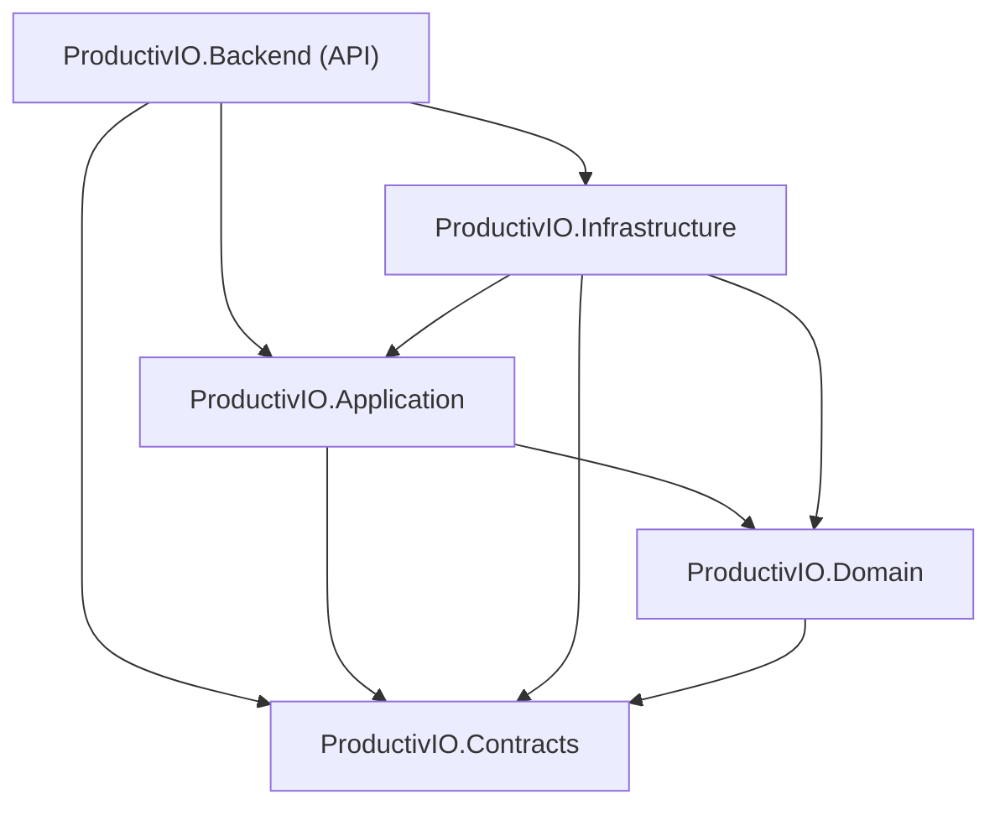
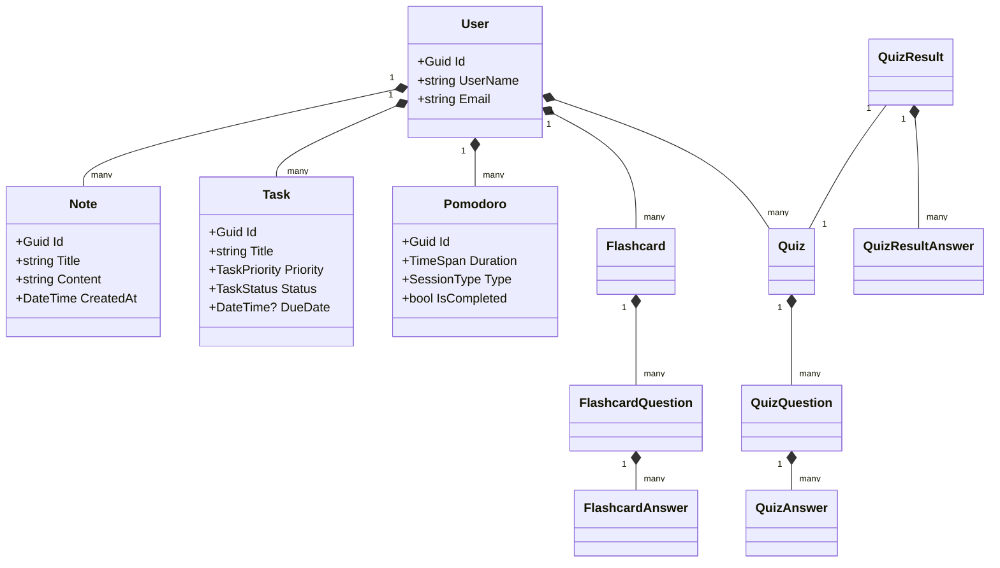
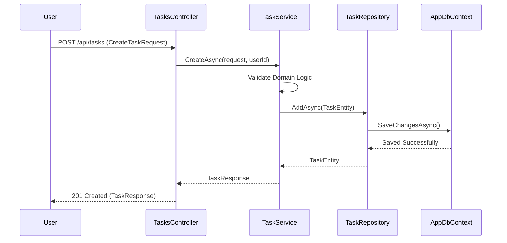

# Software Engineering Document: ProductivIO

## 1. Project Overview
ProductivIO is a high-performance productivity ecosystem designed to help users manage notes, tasks, Pomodoro sessions, and educational materials (flashcards/quizzes). The backend is built with a **Clean Architecture** approach using .NET 9, ensuring scalability, testability, and clear separation of concerns.

## 2. Requirements

### 2.1 Functional Requirements
- **Authentication & Security**: Secure user registration, login , and role-based access control. All data is scoped to the authenticated user.
- **Note Management**: Full CRUD operations for rich-text notes.
- **Task & Habit Tracking**: 
  - Manage tasks with priorities (Low, Medium, High) and statuses (Todo, InProgress, Completed).
  - Set due dates and track task progress.
- **Pomodoro Engine**: Track work and break sessions with customizable durations and session types.
- **Learning Management**:
  - Create flashcard decks for active recall.
  - Generate and take quizzes based on study materials.
  - Track quiz results and history.
- **Automated Metadata**: Automatic tracking of `CreatedAt` and `UpdatedAt` timestamps for all entities.

### 2.2 Non-Functional Requirements
- **Maintainability**: Clean Architecture ensures low coupling and high cohesion.
- **Type Safety**: Extensive use of enums and DTOs to minimize runtime errors.
- **Reliability**: Comprehensive unit and integration test coverage.
- **Security**: Data isolation per user and industry-standard JWT authentication.

---

## 3. Architecture & Design

### 3.1 Clean Architecture Layers

- **Domain**: Pure business logic, core entities, and domain exceptions. No external dependencies.
- **Application**: Use cases, service logic, DTO mapping, and repository interfaces.
- **Infrastructure**: Data access (EF Core), external service implementations, and repository concrete classes.
- **Contracts**: Shared DTOs and Enums for API communication.
- **Backend (Web API)**: Controllers, DI configuration, and HTTP-related logic.

### 3.2 Database Schema (Class Diagram)

### 3.3 Create Task Flow (Sequence Diagram)

---

## 4. Technical Stack
- **Framework**: .NET 9.0
- **ORM**: Entity Framework Core
- **Database**: MS SQL Server (In-Memory for Tests)
- **Testing**: xUnit, FluentAssertions, Moq
- **Docs**: Mermaid (UML), GitHub Markdown
