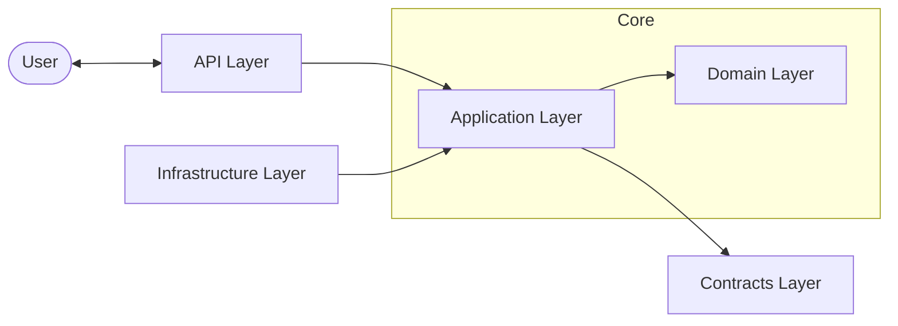

# ProductivIO 🚀

[](https://dotnet.microsoft.com/download/dotnet/9.0)
[](LICENSE)
[](DOCS/SOFTWARE_ENGINEERING.md)

**ProductivIO** is a robust, high-performance productivity ecosystem designed to streamline your daily workflow. Whether you're managing complex tasks, taking structured notes, or deep-diving into study materials using the built-in Pomodoro engine and learning modules, ProductivIO provides the architectural foundation for a modern productivity app.

---

## ✨ Key Features

- **🛡 Enterprise Security**: ASP.NET Core Identity integration with JWT-based authentication.
- **🏗 Clean Architecture**: Decoupled layers (Domain, Application, Infrastructure, Contracts) for maximum maintainability.
- **⚡ Domain Driven Design (DDD)**: Rich domain models with encapsulated business logic.
- **📊 Advanced Task Management**: Kanban-ready statuses and priority-based task tracking.
- **🍅 Pomodoro Integration**: Full session tracking with work/break analytics.
- **🎓 Learning Hub**: Flashcard management and interactive quizzes with result history.
- **🧪 Testing First**: Robust unit and integration testing suite with 100% core logic coverage.

---

## 🏗 System Architecture

ProductivIO follows a strict **Clean Architecture** pattern to ensure the business logic remains independent of UI, database, and frameworks.

### 📐 Architectural Overview



*For detailed UML diagrams and software engineering requirements, check the [Software Engineering Document](DOCS/SOFTWARE_ENGINEERING.md).*

---

## 🚀 Getting Started

### Prerequisites
- [.NET 9.0 SDK](https://dotnet.microsoft.com/download/dotnet/9.0)
- [SQL Server](https://www.microsoft.com/en-us/sql-server/sql-server-downloads) (or LocalDB)

### Local Development

1. **Clone the repository:**
   ```bash
   git clone https://github.com/Moumen-Qasiim/ProductivIO-Backend.git
   cd ProductivIO-Backend
   ```

2. **Run Migrations:**
   The application uses automatic migrations on startup during development. Ensure your connection string in `appsettings.json` is correct.

3. **Run the API:**
   ```bash
   dotnet run --project ProductivIO.Backend
   ```

4. **Run Tests:**
   ```bash
   dotnet test
   ```

---

## 🛠 Tech Stack

- **Core**: .NET 9.0, ASP.NET Core
- **Database**: Entity Framework Core, SQL Server
- **Authentication**: Microsoft Identity, JWT
- **Testing**: xUnit, Moq, FluentAssertions
- **Validation**: DataAnnotations, Custom Domain Validation

---

## 📄 Documentation

- [Software Engineering Requirements & UML](DOCS/SOFTWARE_ENGINEERING.md)
- [API Specification (Swagger)](http://localhost:5104/swagger) (Available when running locally)

---

## 🤝 Contributing

Contributions are welcome! Please feel free to submit a Pull Request.

## 📜 License

This project is licensed under the MIT License - see the [LICENSE](LICENSE) file for details.
